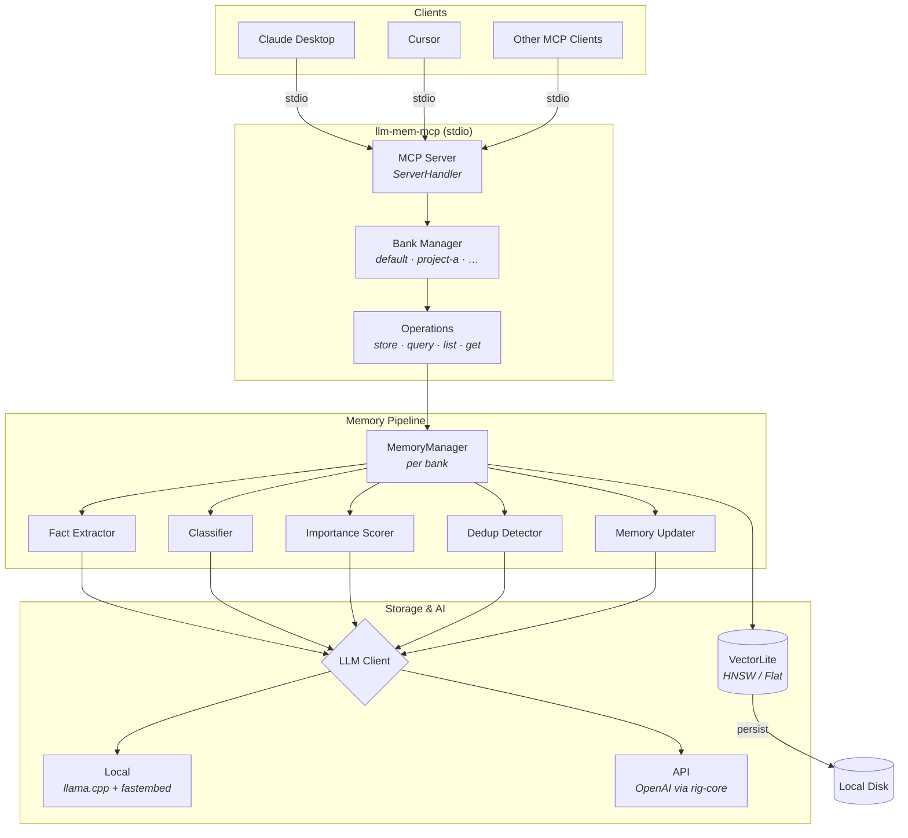

# llm-mem

A standalone MCP memory server with an embedded vector store for AI agents. Built in Rust as a single self-contained crate — no external databases required.

> [!WARNING]  
> **ALPHA STATUS**: This project is very much in an early alpha stage. It is highly experimental, subject to breaking changes, and intended *only* for testing and try-out scenarios. Do not use in production.

## Features

- **Hierarchical Knowledge Graph** — Automatically builds a navigable structure for your data. Chunks are linked via `next_chunk`/`previous_chunk` relations, nested under explicit `header` nodes with `part_of` relations, and cross-linked between documents via semantic `references`.
- **Stateful Document Ingestion** — Session-based API for large files. Upload in parts, track background processing status, and survive reboots. Prevents MCP payload limits and ensures reliable ingestion of multi-megabyte documents.
- **Verbatim Content Storage (High-Fidelity RAG)** — Documents are mechanically chunked using semantic boundaries (via `text-splitter`), preserving original text for high-fidelity retrieval.
- **AI-Powered Metadata Enrichment** — Uses a specialized prompt to extract concise summaries and keywords for every chunk, enabling powerful hybrid search without altering the source text.
- **Local inference (default)** — Uses [llama.cpp](https://github.com/ggerganov/llama.cpp) via [llama-cpp-2](https://crates.io/crates/llama-cpp-2) for LLM completions and [fastembed](https://crates.io/crates/fastembed) for embeddings.
- **Auto-download models** — Known GGUF models are automatically downloaded from Hugging Face on first run with resume and SHA-256 verification.
- **Embedded vector store** — Uses [VectorLite](https://crates.io/crates/vectorlite) with HNSW/Flat indexes. No external databases required.
- **Hybrid Search (Semantic + Keyword)** — `query_memory` performs hybrid search by default: semantic similarity search boosted by keyword matching.
- **Dynamic Context Length** — Automatically scales memory usage per request (4k up to 16k+ tokens) without model reloading.
- **MCP server** — Exposes memory tools via the [Model Context Protocol](https://modelcontextprotocol.io/) over stdio.
- **Memory banks** — Organize memories into named, isolated stores (e.g., per-project, per-domain). Each bank gets its own database file.
- **Dynamic Context Length** — Automatically scales memory usage per request. Small prompts use less RAM (4k tokens), while larger prompts can expand up to the configured maximum (e.g., 16k+) without model reloading.
- **MCP server** — Exposes memory tools via the [Model Context Protocol](https://modelcontextprotocol.io/) over stdio, compatible with Claude Desktop, Cursor, and other MCP clients.
- **Semantic search** — Store and retrieve memories using natural language queries with cosine/euclidean/dot-product similarity.
- **Multiple memory types** — Conversational, Procedural, Factual, Semantic, Episodic, and Personal.
- **LLM-powered processing** — Automatic fact extraction, importance scoring, deduplication, classification, and memory updates.
- **Dual backend** — Switch between local inference and OpenAI-compatible APIs via config. Auto-detects: if API keys are set, uses OpenAI; otherwise, uses local.
- **Memory banks** — Organize memories into named, isolated stores (e.g., per-project, per-domain). Each bank gets its own database file. Banks are lazily loaded and share a single LLM client for efficiency.
- **Configurable** — TOML-based configuration for LLM, embeddings, vector store, and memory behavior.
- **Library + Binary** — Use as a Rust library (`llm_mem`) or run the `llm-mem-mcp` binary directly.

## Quick Start

### Prerequisites

- Rust 2024 edition (1.85+)
- C/C++ compiler and CMake (for llama.cpp compilation)
- For GPU acceleration (optional but recommended):
  - **Vulkan** (AMD/Intel GPUs on Linux) — enabled by default
  - **CUDA** (NVIDIA GPUs) — use `--features cuda`

### Build

```bash
# Default build (includes local inference + Vulkan GPU support)
cargo build --release

# Without GPU support (CPU only)
cargo build --release --no-default-features --features local

# With CUDA instead of Vulkan (NVIDIA GPUs)
cargo build --release --no-default-features --features "local,cuda"

# API-only build (no local inference, smaller binary, no C++ deps)
cargo build --release --no-default-features
```

#### GPU Acceleration

llm-mem supports GPU acceleration via **Vulkan** (default) or **CUDA**:

| Backend | GPU Types | Status |
|---------|-----------|--------|
| Vulkan | AMD, Intel, NVIDIA (Linux) | Enabled by default |
| CUDA | NVIDIA only | Use `--features cuda` |

To verify Vulkan is working on your system:
```bash
vulkaninfo --summary | grep "deviceName"
```

Configure GPU offload in `config.toml`:
```toml
[local]
gpu_layers = 20  # Number of model layers to offload to GPU (0 = CPU only)
```

### Configure

The server works **out of the box with local inference** — no config file required.
On first run it will auto-download:
- The default LLM model (~1.1 GB GGUF from Hugging Face)
- The embedding model (~90 MB ONNX via fastembed)

Downloads support **resume** (interrupted downloads continue where they left off) and **SHA-256 verification**.

To use a different model, or to download manually:

```bash
# Manual download (optional — auto-download handles this)
mkdir -p llm-mem-data/models
curl -L -o llm-mem-data/models/qwen2.5-1.5b-instruct-q4_k_m.gguf \
  https://huggingface.co/Qwen/Qwen2.5-1.5B-Instruct-GGUF/resolve/main/qwen2.5-1.5b-instruct-q4_k_m.gguf
```

Optionally create a `config.toml` to customize settings:

```toml
# Backend: auto-detected if omitted.
# "local" = llama.cpp + fastembed (default when no API keys set)
# "openai" = external API (default when API keys are set)
# backend = "local"

[local]
models_dir = "llm-mem-data/models"                     # Where to store models
llm_model_file = "qwen2.5-1.5b-instruct-q4_k_m.gguf"  # GGUF model filename
embedding_model = "all-MiniLM-L6-v2"                   # fastembed model (auto-downloaded)
gpu_layers = 0                                         # 0 = CPU only, 99 = full GPU offload
context_size = 2048
temperature = 0.7
max_tokens = 1024
cpu_threads = 0                                        # 0 = auto (uses all CPU cores), set to N for specific count
auto_download = true                                   # Auto-download models from HuggingFace
# proxy_url = "http://proxy:port"                       # Proxy for model downloads

# —— Or use an external API ——
# Setting these API keys automatically switches to the OpenAI backend:

[llm]
api_base_url = "https://api.openai.com/v1"
api_key = "sk-..."  # or set OPENAI_API_KEY / LLM_MEM_LLM_API_KEY env var
model_efficient = "gpt-4o-mini"

[embedding]
api_base_url = "https://api.openai.com/v1"
api_key = "sk-..."  # or set OPENAI_API_KEY / LLM_MEM_EMBEDDING_API_KEY env var
model_name = "text-embedding-3-small"

[vector_store]
store_type = "vectorlite"
collection_name = "llm-memories"
banks_dir = "llm-mem-banks"       # Directory for memory bank .db files

[vector_store.vectorlite]
index_type = "hnsw"
metric = "cosine"
# persistence_path = "/path/to/data"

[memory]
similarity_threshold = 0.65
deduplicate = true
auto_enhance = true
```

### Run

```bash
# Just run — auto-downloads models on first run, no config needed
./target/release/llm-mem-mcp

# With explicit config path
./target/release/llm-mem-mcp --config /path/to/config.toml

# With agent identifier
./target/release/llm-mem-mcp --agent my-agent

# With custom memory banks directory
./target/release/llm-mem-mcp --banks-dir /path/to/banks

# Behind a proxy (overrides HTTPS_PROXY env var)
./target/release/llm-mem-mcp --proxy http://proxy:3128
```

### Logging & Troubleshooting

The server uses structured logging via `tracing`. You can control log verbosity using the `RUST_LOG` environment variable.

- **Default:** `info` (shows startup info, requests, errors)
- **Debug:** `debug` (shows internal logic, memory operations)
- **Trace:** `trace` (shows extremely detailed flow)

To see internal logs from the `llama.cpp` inference engine, target the `llama_cpp_2` crate specifically:

```bash
# Enable debug logs for llm-mem and llama.cpp
RUST_LOG=debug,llama_cpp_2=debug ./target/release/llm-mem-mcp

# Enable only warnings/errors, but full debug for llama.cpp
RUST_LOG=warn,llama_cpp_2=debug ./target/release/llm-mem-mcp
```

### Model Auto-Download

On first run, llm-mem automatically downloads the LLM model file from Hugging Face.
The download is robust:

- **Resume support** — Interrupted downloads are saved as `.partial` files and resumed automatically on restart.
- **SHA-256 checksum** — Downloaded files are verified against known checksums to detect corruption.
- **Proxy-aware** — Detects `HTTPS_PROXY`, `HTTP_PROXY`, `ALL_PROXY`, and `NO_PROXY` environment variables. Can also be configured via `[local] proxy_url` in config.toml or `--proxy` CLI flag.
- **Helpful errors** — Network failures include proxy guidance and manual download instructions.

Currently auto-downloadable models:

| Filename | Size | Description |
|----------|------|-------------|
| `qwen2.5-1.5b-instruct-q4_k_m.gguf` | ~1.1 GB | Qwen2.5 1.5B Instruct (Q4_K_M) — default |
| `smollm2-1.7b-instruct-q4_k_m.gguf` | ~1.0 GB | SmolLM2 1.7B Instruct (Q4_K_M) |

To disable auto-download, set `auto_download = false` in `[local]` config:

```toml
[local]
auto_download = false
```

### Environment Variables

API keys, endpoints, and proxy settings can be set via environment variables instead of (or in addition to) `config.toml`. Env vars take precedence over config file values.

| Variable | Overrides | Description |
|----------|-----------|-------------|
| `OPENAI_API_KEY` | `llm.api_key` + `embedding.api_key` | Fallback for both keys if not set individually |
| `LLM_MEM_LLM_API_KEY` | `llm.api_key` | LLM completions API key |
| `LLM_MEM_LLM_API_BASE_URL` | `llm.api_base_url` | LLM API endpoint |
| `LLM_MEM_LLM_MODEL` | `llm.model_efficient` | LLM model name |
| `LLM_MEM_EMBEDDING_API_KEY` | `embedding.api_key` | Embedding API key |
| `LLM_MEM_EMBEDDING_API_BASE_URL` | `embedding.api_base_url` | Embedding API endpoint |
| `LLM_MEM_EMBEDDING_MODEL` | `embedding.model_name` | Embedding model name |
| `HTTPS_PROXY` / `https_proxy` | `local.proxy_url` | HTTPS proxy for model downloads |
| `HTTP_PROXY` / `http_proxy` | (fallback) | HTTP proxy for model downloads |
| `ALL_PROXY` / `all_proxy` | (fallback) | Catch-all proxy |
| `NO_PROXY` / `no_proxy` | — | Comma-separated hosts to bypass proxy |

### MCP Client Configuration

Add to your MCP client config (e.g. Claude Desktop `claude_desktop_config.json`):

```json
{
  "mcpServers": {
    "memory": {
      "command": "/path/to/llm-mem-mcp",
      "args": ["--config", "/path/to/config.toml"]
    }
  }
}
```

## MCP Tools

| Tool | Description |
|------|-------------|
| `system_status` | **Call first.** Reports backend type, model availability, active document sessions, and configuration details |
| `add_content_memory` | Store raw content **WITHOUT AI transformation** — exact text is preserved for semantic search. Best for: conversation logs, snippets, or small text blocks |
| `add_intuitive_memory` | Store memories with **AI-powered extraction** — LLM analyzes content, extracts structured facts, and auto-generates keywords for hybrid search |
| `begin_store_document` | **Start Document Ingestion.** Returns `session_id` and requirements for multi-part document upload |
| `store_document_part` | Upload a single part/chunk of a document to an active session |
| `process_document` | Finalize upload and start background processing (chunking, enrichment, graph indexing) |
| `status_process_document` | Check progress of a document processing session (shows chunks processed, status, and errors) |
| `cancel_process_document` | Cancel an active session and cleanup temporary storage |
| `query_memory` | **Hybrid semantic + keyword search** — Searches by meaning AND boosts scores for memories with matching keywords |
| `list_memories` | List memories with optional filtering by type, user, agent, or date range |
| `get_memory` | Retrieve a specific memory by its ID, including its graph relations |
| `list_memory_banks` | List all available memory banks with name, path, memory count, and description |
| `create_memory_bank` | Create a new named memory bank with an optional description |

**Note:** `store_memory` and `add_memory` are aliases for backward compatibility.

## Memory Banks

Memory banks let you organize memories into **named, isolated stores**. Each bank has its own database file, its own set of memories, and does not interfere with other banks. Use cases:

- **Per-project context** — `bank: "my-rust-project"` vs `bank: "web-app"`
- **Per-domain knowledge** — `bank: "cooking"` vs `bank: "finance"`
- **Per-conversation** — keep short-lived context separate from long-term knowledge

### How It Works

- A **default** bank is always available and used when no `bank` parameter is specified
- Banks are **lazily created** on first use — just pass `bank: "my-bank"` to any tool
- Banks are stored as individual `.db` files in a configurable `banks_dir` (default: `llm-mem-banks/`)
- All banks share one LLM client instance — only the vector storage is isolated
- Bank names: alphanumeric, hyphens, underscores, 1–64 characters

### Usage via MCP Tools

```jsonc
// Store raw content (exact text preserved)
{ "tool": "add_content_memory", "arguments": { "content": "User loves vegan chili recipes", "bank": "my-project" } }

// Store with AI extraction (auto keywords generated)
{ "tool": "add_intuitive_memory", "arguments": { "messages": [{"role": "user", "content": "I love making vegan chili on weekends"}], "bank": "my-project" } }

// Link intuitive memory to source content memory
{ "tool": "add_intuitive_memory", "arguments": { "messages": [...], "source_memory_id": "raw-memory-uuid", "bank": "my-project" } }

// Hybrid search (semantic + keyword boosting)
{ "tool": "query_memory", "arguments": { "query": "vegan recipes", "bank": "my-project" } }

// --- Document Ingestion Flow ---

// 1. Start a session
{ "tool": "begin_store_document", "arguments": { "file_name": "manual.md", "total_size": 15000, "bank": "docs" } }
// Returns: { "session_id": "sess-123", "chunk_size_bytes": 8192, "expected_parts": 2 }

// 2. Upload parts
{ "tool": "store_document_part", "arguments": { "session_id": "sess-123", "part_index": 0, "content": "...text...", "bank": "docs" } }

// 3. Process (background)
{ "tool": "process_document", "arguments": { "session_id": "sess-123", "bank": "docs" } }

// 4. Check status
{ "tool": "status_process_document", "arguments": { "session_id": "sess-123", "bank": "docs" } }
// Returns: { "status": "processing", "chunks_processed": 5, "total_chunks": 10 }

// --- End Document Ingestion ---

// List all banks
{ "tool": "list_memory_banks" }

// Create a bank with a description
{ "tool": "create_memory_bank", "arguments": { "name": "research", "description": "Papers and findings" } }
```

### CLI Flag

```bash
# Override the banks directory
./target/release/llm-mem-mcp --banks-dir /data/memory-banks
```

### Config

```toml
[vector_store]
banks_dir = "llm-mem-banks"   # Directory for bank .db files
```

## Performance & Context Handling

When using the `local` backend with `llama.cpp`:

*   **Model Weights:** The GGUF model is loaded into RAM/VRAM once at startup. It is **never reloaded** between requests.
*   **Dynamic Context:** The context buffer (KV cache) is allocated **per request** based on the prompt size.
    *   Small request (e.g., 500 tokens) → Allocates minimal 4K context.
    *   Large request (e.g., 12k tokens) → Automatically scales up to 16K (or your configured `context_size`).
    *   This ensures RAM is used efficiently and only when needed.
*   **Concurrency:** By default, LLM requests are processed sequentially (`max_concurrent_requests = 1`) to prevent CPU/RAM overload on consumer hardware.

### CPU Thread Configuration

By default, llm-mem automatically detects your CPU core count and uses all available cores. You can override this:

```toml
[local]
cpu_threads = 0   # 0 = auto-detect (default, uses all cores)
cpu_threads = 8   # Use 8 threads regardless of CPU count
```

**Why change this?**
- If you see only 400% CPU usage on a 16-core CPU, the default detection may have been conservative. Set `cpu_threads = 0` (auto) or manually set to your core count (e.g., `cpu_threads = 16` for 16 threads).
- Lower values can reduce system lag if you're using the computer for other tasks during inference.
- Higher values maximize throughput for batch processing.

## Architecture



### Source Layout

```
src/
├── lib.rs              # Public API surface
├── config.rs           # TOML configuration
├── error.rs            # Error types
├── types.rs            # Core types (Memory, MemoryType, Filters, etc.)
├── vector_store.rs     # VectorStore trait + VectorLiteStore implementation
├── operations.rs       # High-level operations + MCP tool definitions
├── mcp.rs              # MCP ServerHandler implementation
├── memory_bank.rs      # Memory bank manager (named, isolated stores)
├── bin/
│   └── mcp.rs          # Binary entrypoint (CLI)
├── llm/
│   ├── mod.rs
│   ├── client.rs       # LLMClient trait + OpenAI implementation (via rig-core)
│   ├── local_client.rs # Local inference via llama.cpp + fastembed
│   ├── model_downloader.rs # Auto-download models from HuggingFace (resume, checksum, proxy)
│   └── extractor_types.rs  # Structured extraction types (JsonSchema)
└── memory/
    ├── mod.rs
    ├── manager.rs      # MemoryManager orchestrator
    ├── extractor.rs    # Fact extraction from conversations
    ├── updater.rs      # Memory create/update/delete/merge logic
    ├── importance.rs   # Importance scoring (LLM / rule-based / hybrid)
    ├── deduplication.rs # Duplicate detection and merging
    ├── classification.rs # Memory type classification and entity extraction
    ├── prompts.rs      # System prompts for LLM operations
    └── utils.rs        # Text processing utilities
```

## Using as a Library

```rust
use llm_mem::{Config, MemoryManager, MemoryMcpService, MemoryBankManager};

// Option 1: Use the MCP service directly (local inference, no config needed)
let service = MemoryMcpService::new().await?;

// Option 2: Use with explicit config
let service = MemoryMcpService::with_config_path("config.toml").await?;

// Option 3: Use individual components
let config = Config::load("config.toml")?;
let llm_client = llm_mem::llm::create_llm_client(&config).await?;
let vector_store = Box::new(llm_mem::vector_store::VectorLiteStore::with_config(
    llm_mem::vector_store::VectorLiteConfig::from_store_config(&config.vector_store),
)?);
let manager = MemoryManager::new(vector_store, llm_client, config.memory);

// Option 4: Use memory banks for isolated per-project stores
let config = Config::load("config.toml")?;
let llm_client = llm_mem::llm::create_llm_client(&config).await?;
let bank_manager = MemoryBankManager::new(
    std::path::PathBuf::from(&config.vector_store.banks_dir),
    llm_client,
    config.vector_store,
    config.memory,
)?;
// Access isolated banks by name
let project_bank = bank_manager.get_or_create("my-project").await?;
let default_bank = bank_manager.default_bank().await?;
```

## Key Dependencies

| Crate | Purpose |
|-------|---------|
| [llama-cpp-2](https://crates.io/crates/llama-cpp-2) 0.1 | Local LLM inference via llama.cpp (GGUF models, CPU/GPU) |
| [fastembed](https://crates.io/crates/fastembed) 4 | Local embeddings via ONNX Runtime (auto-downloads models) |
| [reqwest](https://crates.io/crates/reqwest) 0.12 | HTTP client for model downloads (streaming, proxy support) |
| [vectorlite](https://crates.io/crates/vectorlite) 0.1.5 | Embedded vector store (HNSW/Flat indexes) |
| [rig-core](https://crates.io/crates/rig-core) 0.23 | OpenAI-compatible LLM client (completions + embeddings + extractors) |
| [rmcp](https://crates.io/crates/rmcp) 0.10 | Model Context Protocol server (stdio transport) |
| [tokio](https://crates.io/crates/tokio) 1.48 | Async runtime |
| [schemars](https://crates.io/crates/schemars) 1.0 | JSON Schema generation for structured LLM extraction |

## Testing

The project has tests across multiple files: unit tests (in `src/`), integration tests (in `tests/integration_tests.rs` — includes memory bank tests), and 8 retrieval accuracy evaluations (in `tests/evaluation.rs`, `#[ignore]`d).

### Running Tests

```bash
# ── All standard tests (unit + integration, ~271 tests) ──────────────
cargo test

# ── Unit tests only (in src/) ────────────────────────────────────────
cargo test --lib

# ── Integration tests only ───────────────────────────────────────────
cargo test --test integration_tests

# ── Specific unit test modules ───────────────────────────────────────
cargo test --lib utils              # memory/utils.rs tests (27)
cargo test --lib model_downloader   # llm/model_downloader.rs tests (53)
cargo test --lib local_client       # llm/local_client.rs tests (8)

# ── Run a single test by name ────────────────────────────────────────
cargo test test_memory_hash_consistency

# ── With output (println! visible) ───────────────────────────────────
cargo test -- --nocapture

# ── API-only build tests (no local/llama.cpp features) ───────────────
cargo test --no-default-features
```

### Retrieval Accuracy Evaluation

An optional evaluation suite measures retrieval quality using real semantic embeddings (all-MiniLM-L6-v2, 384 dimensions). It stores 15 curated memories across 6 memory types and runs 20 queries with ground-truth expected results, reporting standard IR metrics.

```bash
# ── All evaluation tests (mock + real LLM) ───────────────────────────
cargo test --test evaluation -- --ignored --nocapture

# ── Mock-LLM evaluations only (fast, ~90 MB embedding model) ────────
cargo test --test evaluation evaluation_retrieval_accuracy -- --ignored --nocapture
cargo test --test evaluation evaluation_full_pipeline_accuracy -- --ignored --nocapture
cargo test --test evaluation evaluation_type_filtered_retrieval -- --ignored --nocapture
cargo test --test evaluation evaluation_similarity_discrimination -- --ignored --nocapture

# ── Real-LLM evaluations only (slow, requires GGUF model ~1.1 GB) ───
cargo test --test evaluation evaluation_real_llm -- --ignored --nocapture

# ── Individual real-LLM tests ───────────────────────────────────────
cargo test --test evaluation evaluation_real_llm_pipeline_accuracy -- --ignored --nocapture
cargo test --test evaluation evaluation_real_llm_fact_extraction -- --ignored --nocapture
cargo test --test evaluation evaluation_real_llm_deduplication -- --ignored --nocapture
cargo test --test evaluation evaluation_real_llm_discrimination -- --ignored --nocapture
```

**Mock-LLM evaluations** (fast — real embeddings, mock LLM completions):

| Test | Description | Key thresholds |
|------|-------------|---------------|
| `evaluation_retrieval_accuracy` | Direct vector store + real embeddings | R@1≥60%, R@3≥80%, MRR≥0.65 |
| `evaluation_full_pipeline_accuracy` | Full MemoryManager pipeline | R@1≥50%, R@3≥70% |
| `evaluation_type_filtered_retrieval` | Searches filtered by MemoryType | Filtered recall≥50% |
| `evaluation_similarity_discrimination` | Confusable queries (Japan travel vs Japanese study, etc.) | R@1≥50%, R@3≥70% |

**Real-LLM evaluations** (slow — real llama.cpp inference for all LLM operations):

| Test | Description | Key thresholds |
|------|-------------|---------------|
| `evaluation_real_llm_pipeline_accuracy` | End-to-end with real LLM fact extraction, classification, importance scoring | R@1≥40%, R@3≥60%, R@5≥70% |
| `evaluation_real_llm_fact_extraction` | Validates LLM-extracted facts and keywords against expected terms | ≥4 facts, ≥3/4 with keywords |
| `evaluation_real_llm_deduplication` | Tests duplicate detection on known duplicate/distinct pairs | ≥3/5 correct |
| `evaluation_real_llm_discrimination` | Hardest: real LLM processing + confusable queries | R@3≥50% |

> **Note:** The first run downloads the embedding model (~90 MB). Evaluation tests are `#[ignore]`d so they don't run during normal `cargo test`.

## Acknowledgements

This project was inspired by and draws from the architecture of [cortex-mem](https://github.com/Sopaco/cortex-mem) by Sopaco — a multi-crate memory management system for AI agents. The memory processing pipeline (fact extraction, importance scoring, deduplication, classification, and update logic) was reimplemented as a single self-contained crate with VectorLite as the sole embedded vector backend.

## License

MIT

## Memory Linking (Cross-Mode Relations)

Link structured insights to their source content using the `source_memory_id` parameter:

### Workflow: Raw Content → Structured Insights

```
Step 1: Store raw conversation
┌─────────────────────────────────────┐
│  add_content_memory                 │
│  content: "User: I love vegan chili │
│           Assistant: That's great!" │
│  → Returns: "mem-abc-123"           │
└─────────────────────────────────────┘
           │
           ▼
Step 2: Extract with link
┌─────────────────────────────────────┐
│  add_intuitive_memory               │
│  messages: [...]                    │
│  source_memory_id: "mem-abc-123" ←──┼── Creates "derived_from" relation
│  → Creates intuitive memory with    │
│    relation to source               │
└─────────────────────────────────────┘
```

### Usage

```jsonc
// Store raw content
{ "tool": "add_content_memory", 
  "arguments": { 
    "content": "Full conversation text...",
    "bank": "my-project" 
  } 
}
// Returns: { "memory_id": "raw-uuid" }

// Create structured memory linked to source
{ "tool": "add_intuitive_memory", 
  "arguments": { 
    "messages": [{"role": "user", "content": "..."}],
    "source_memory_id": "raw-uuid",  // ← Links to source
    "bank": "my-project" 
  } 
}
// Creates automatic relation: "derived_from" → "raw-uuid"

// Navigate back to source
{ "tool": "get_memory", 
  "arguments": { 
    "memory_id": "intuitive-uuid",
    "bank": "my-project" 
  } 
}
// Returns memory with relations showing source
```

### Design Principles

- **One-way linking**: Intuitive memories reference sources, not vice versa
- **No hallucination**: Source memory doesn't know about derived memories
- **Manual navigation**: Use `get_memory` to follow relations
- **Future enhancement**: Relation-following search (not yet implemented)