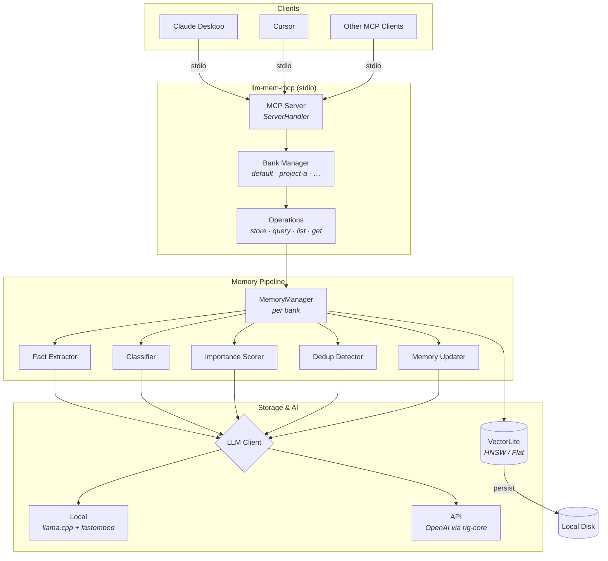

# llm-mem

A memory server for AI agents. It remembers things so your AI assistant doesn't forget.

Built as a single self-contained program in Rust — no databases, no cloud services, no setup headaches. Just run it and it works.

> [!WARNING]
> **This is alpha software.** Expect rough edges, breaking changes, and experimental behavior. Use it to try things out, not for anything important.

## What does it do?

You connect llm-mem to an AI assistant (like Claude Desktop or Cursor). It gives the assistant the ability to:

- **Remember things** — Save facts, conversations, notes, or entire documents
- **Recall things** — Search memories by meaning, not just keywords
- **Organize things** — Automatically categorize, summarize, and link related memories
- **Build knowledge** — Over time, raw notes get distilled into higher-level concepts

Everything runs locally on your machine by default. No API keys needed. No data leaves your computer.

---

<details>
<summary><strong>Getting started</strong></summary>

### What you need

- Rust 1.85+ (2024 edition)
- A C/C++ compiler and CMake (needed to compile the built-in AI engine)

### Build it

```bash
cargo build --release
```

This gives you three programs in `target/release/`:

| Program | What it does |
|---------|-------------|
| `llm-mem-mcp` | Connects to AI assistants (Claude Desktop, Cursor, etc.) |
| `llm-mem` | Standalone command-line tool with interactive mode |
| `llm-mem-inspect` | Peek inside your memory banks |

### Run it

```bash
# For AI assistants (MCP server)
./target/release/llm-mem-mcp

# Interactive command line
./target/release/llm-mem

# Inspect memory banks
./target/release/llm-mem-inspect
```

On first run, it automatically downloads the AI models it needs (~2 GB for the language model, ~90 MB for the embedding model). Downloads can be resumed if interrupted.

<details>
<summary>Connect to Claude Desktop</summary>

Add this to your Claude Desktop config file (`claude_desktop_config.json`):

```json
{
  "mcpServers": {
    "memory": {
      "command": "/path/to/llm-mem-mcp",
      "args": ["--config", "/path/to/config.toml"]
    }
  }
}
```

</details>

<details>
<summary>Manual model download</summary>

If auto-download doesn't work (corporate proxy, air-gapped machine, etc.), you can download models manually:

```bash
mkdir -p llm-mem-data/models
curl -L -o llm-mem-data/models/Qwen3.5-2B-UD-Q6_K_XL.gguf \
  https://huggingface.co/unsloth/Qwen3.5-2B-GGUF/resolve/main/Qwen3.5-2B-UD-Q6_K_XL.gguf
```

To disable auto-download:

```toml
[llm]
auto_download = false
```

</details>

</details>

---

<details>
<summary><strong>Configuration</strong></summary>

llm-mem works **without any config file** — it uses sensible defaults with local AI models.

If you want to customize, create a `config.toml`:

```bash
./target/release/llm-mem generate-config --output config.toml
```

The config has two main sections — one for the AI brain, one for the search engine:

```toml
# The AI brain — answers questions, extracts facts, summarizes
[llm]
provider = "local"       # "local" = runs on your machine (default)
                         # "api"   = uses an online service (OpenAI, etc.)

# The search engine — finds similar memories
[embedding]
provider = "local"       # "local" = runs on your machine (default)
                         # "api"   = uses an online service
```

<details>
<summary>Run everything locally (default)</summary>

No config file needed. If you want to tweak things:

```toml
[llm]
provider = "local"
model_file = "Qwen3.5-2B-UD-Q6_K_XL.gguf"  # which AI model to use
gpu_layers = 0                                # 0 = CPU only, higher = use GPU
context_size = 16644                          # how much text it can process at once
temperature = 0.7                             # creativity (0 = precise, 1 = creative)
max_tokens = 4096                             # max response length
auto_download = true                          # auto-download models on first run

[embedding]
provider = "local"
model = "all-MiniLM-L6-v2"
```

</details>

<details>
<summary>Use an online API (OpenAI, OpenRouter, etc.)</summary>

```toml
[llm]
provider = "api"
api_url = "https://api.openai.com/v1"
api_key = "sk-..."                    # or set LLM_MEM_LLM_API_KEY env var
model = "gpt-4o-mini"

[embedding]
provider = "api"
api_url = "https://api.openai.com/v1"
api_key = "sk-..."                    # or set LLM_MEM_EMBEDDING_API_KEY env var
model = "text-embedding-3-small"
```

Common API endpoints:
- **OpenAI:** `https://api.openai.com/v1`
- **OpenRouter:** `https://openrouter.ai/api/v1`
- **Ollama:** `http://localhost:11434/v1`

</details>

<details>
<summary>Mix and match (e.g. online AI + local search)</summary>

You can use an online API for the AI brain but keep search local (or vice versa):

```toml
[llm]
provider = "api"
api_url = "https://openrouter.ai/api/v1"
api_key = ""  # set LLM_MEM_LLM_API_KEY env var
model = "meta-llama/llama-3.1-8b-instruct"

[embedding]
provider = "local"
model = "all-MiniLM-L6-v2"
```

</details>

<details>
<summary>Use a local llama-server</summary>

If you already run [llama-server](https://github.com/ggerganov/llama.cpp) separately:

```toml
[llm]
provider = "api"
api_url = "http://localhost:8080/v1"
api_key = "NONE"
model = "default"

[embedding]
provider = "local"
model = "all-MiniLM-L6-v2"
```

</details>

<details>
<summary>Environment variables</summary>

You can set these instead of (or in addition to) config file values. Environment variables take priority.

| Variable | What it sets | Description |
|----------|-------------|-------------|
| `OPENAI_API_KEY` | Both `llm.api_key` and `embedding.api_key` | Shared API key (fallback) |
| `LLM_MEM_LLM_API_KEY` | `llm.api_key` | AI completions API key |
| `LLM_MEM_LLM_API_BASE_URL` | `llm.api_url` | AI API endpoint |
| `LLM_MEM_LLM_MODEL` | `llm.model` | AI model name |
| `LLM_MEM_EMBEDDING_API_KEY` | `embedding.api_key` | Search embedding API key |
| `LLM_MEM_EMBEDDING_API_BASE_URL` | `embedding.api_url` | Search embedding endpoint |
| `LLM_MEM_EMBEDDING_MODEL` | `embedding.model` | Search embedding model |
| `LLM_MEM_MODELS_DIR` | `llm.models_dir` | Where to store AI models |
| `LLM_MEM_GPU_LAYERS` | `llm.gpu_layers` | GPU acceleration layers |
| `LLM_MEM_CONTEXT_SIZE` | `llm.context_size` | Context window size |
| `LLM_MEM_TEMPERATURE` | `llm.temperature` | AI creativity level |
| `LLM_MEM_MAX_TOKENS` | `llm.max_tokens` | Max response length |
| `LLM_MEM_CPU_THREADS` | `llm.cpu_threads` | CPU threads (0 = auto) |
| `LLM_MEM_MAX_CONCURRENT_REQUESTS` | `llm.max_concurrent_requests` | Parallel request limit |
| `HTTPS_PROXY` / `HTTP_PROXY` / `ALL_PROXY` | `llm.proxy_url` | Network proxy |
| `NO_PROXY` | — | Hosts to bypass proxy |

</details>

<details>
<summary>Full config reference</summary>

```toml
[llm]
provider = "local"                       # "local" or "api"
# --- Local provider ---
model_file = "Qwen3.5-2B-UD-Q6_K_XL.gguf"
models_dir = "llm-mem-data/models"
gpu_layers = 0
context_size = 16644
cpu_threads = 0
auto_download = true
cache_model = true
# cache_dir = "~/.cache/llm-mem/models"
use_grammar = false
llm_timeout_secs = 120
# proxy_url = "http://proxy:port"
# --- API provider ---
# api_url = "https://api.openai.com/v1"
# api_key = ""
# model = "gpt-4o-mini"
# api_dialect = "openai-chat"
# request_format = "auto"
# use_structured_output = true
# structured_output_retries = 2
# --- Shared ---
temperature = 0.7
max_tokens = 4096
max_concurrent_requests = 1
strip_tags = ["think"]
batch_size = 10
batch_max_tokens = 3000
batch_timeout_secs = 120
batch_timeout_multiplier = 1.0

[embedding]
provider = "local"                       # "local" or "api"
model = "all-MiniLM-L6-v2"
# api_url = "https://api.openai.com/v1"
# api_key = ""
# batch_size = 64
# timeout_secs = 30

[vector_store]
banks_dir = "llm-mem-data/banks"
store_type = "vectorlite"
collection_name = "llm-memories"

[vector_store.vectorlite]
index_type = "hnsw"
metric = "cosine"

[memory]
max_memories = 10000
similarity_threshold = 0.65
search_similarity_threshold = 0.35
max_search_results = 50
auto_enhance = true
deduplicate = true
merge_threshold = 0.75
auto_summary_threshold = 32768
max_content_length = 32768
document_chunk_size = 2000

[server]
host = "0.0.0.0"
port = 8000

[logging]
enabled = false
log_directory = "llm-mem-data/logs"
level = "info"
max_size_mb = 1
max_files = 5
```

</details>

</details>

---

<details>
<summary><strong>What can the AI assistant do with it?</strong></summary>

When connected via MCP, your AI assistant gets these tools:

### Storing memories

| Tool | What it does |
|------|-------------|
| `add_content_memory` | Save text exactly as-is (conversations, notes, snippets) |
| `add_intuitive_memory` | Save a conversation and let the AI extract key facts automatically |
| `upload_document` | Upload a small document in one shot |
| `begin_store_document` | Start uploading a large document in parts |
| `store_document_part` | Upload one part of a large document |
| `process_document` | Begin processing an uploaded document (runs in background) |

### Finding memories

| Tool | What it does |
|------|-------------|
| `query_memory` | Search by meaning — finds relevant memories even with different wording |
| `list_memories` | Browse memories with optional filters (type, date, user) |
| `get_memory` | Look up a specific memory by its ID |

### Organizing

| Tool | What it does |
|------|-------------|
| `list_memory_banks` | See all memory banks |
| `create_memory_bank` | Create a new memory bank |
| `backup_bank` | Back up a memory bank |
| `restore_bank` | Restore a memory bank from backup |
| `cleanup_resources` | Clean up temporary files |

### Document processing

| Tool | What it does |
|------|-------------|
| `status_process_document` | Check how far along document processing is |
| `list_document_sessions` | See all document upload sessions |
| `cancel_process_document` | Cancel a document processing session |

### System

| Tool | What it does |
|------|-------------|
| `system_status` | Check that everything is working |
| `start_abstraction_pipeline` | Start background knowledge building |
| `stop_abstraction_pipeline` | Stop background knowledge building |
| `trigger_abstraction` | Manually trigger knowledge building for a memory |

<details>
<summary>Example usage</summary>

```jsonc
// Save a raw note
{ "tool": "add_content_memory",
  "arguments": { "content": "User loves vegan chili recipes", "bank": "cooking" } }

// Save a conversation and extract facts
{ "tool": "add_intuitive_memory",
  "arguments": { "messages": [{"role": "user", "content": "I love making vegan chili on weekends"}], "bank": "cooking" } }

// Search by meaning
{ "tool": "query_memory",
  "arguments": { "query": "vegetarian recipes", "bank": "cooking" } }

// Upload a large document in parts
{ "tool": "begin_store_document",
  "arguments": { "file_name": "manual.md", "total_size": 15000, "bank": "docs" } }
// Returns: { "session_id": "sess-123", "chunk_size_bytes": 8192, "expected_parts": 2 }

{ "tool": "store_document_part",
  "arguments": { "session_id": "sess-123", "part_index": 0, "content": "...text...", "bank": "docs" } }

{ "tool": "process_document",
  "arguments": { "session_id": "sess-123", "bank": "docs" } }
```

</details>

</details>

---

<details>
<summary><strong>Memory banks</strong></summary>

Memory banks let you keep different sets of memories separate — like folders for your AI's brain.

- **Per-project** — one bank for each codebase or project
- **Per-topic** — separate banks for cooking, finance, travel, etc.
- **Per-conversation** — short-lived context vs long-term knowledge

### How they work

- A `default` bank is always there when you don't specify one
- Banks are created automatically the first time you use a name
- Each bank is stored as its own database file
- Banks share the AI engine but keep their memories completely separate
- Bank names: letters, numbers, hyphens, underscores (1–64 characters)

```bash
# Override where bank files are stored
./target/release/llm-mem-mcp --banks-dir /data/memory-banks
```

```toml
[vector_store]
banks_dir = "llm-mem-data/banks"
```

</details>

---

<details>
<summary><strong>How memories build on each other</strong></summary>

llm-mem doesn't just store what you give it — it gradually organizes memories into layers of understanding, like how human memory works:

```
Layer    What it is              Example
─────────────────────────────────────────────────────────────────────
L4       Big-picture insights    "Linear Algebra is about transformations"
L3       Key concepts            "Eigenvalues and Eigenvectors"
L2       Connections             "Relates ODEs to Control Theory"
L1       Summaries               "Chapter 3: Laplace Transforms Summary"
L0       Raw content             "The Laplace transform is defined as..."
L-1      Archived                [Soft-deleted, kept for reference]
```

Background workers automatically create higher layers over time:
1. **Raw → Summaries**: Creates summaries and identifies structure
2. **Summaries → Connections**: Links related memories across documents
3. **Connections → Concepts**: Extracts themes from clusters of related memories

<details>
<summary>Inspecting layers</summary>

```bash
# Show layer statistics
llm-mem-inspect layer-stats -b my-bank

# Show the full hierarchy as a tree
llm-mem-inspect layer-tree -b my-bank --show-ids

# Filter by layer level
llm-mem-inspect layer-tree -b my-bank --from-layer 2 --max-depth 10

# Include archived memories
llm-mem-inspect layer-tree -b my-bank --show-forgotten
```

Example output:
```
Layer Statistics for bank 'default'
============================================================

Overview:
  Total memories:     150
  Active:             142
  Forgotten:          8
  Max layer:          3

By Layer:
  Layer                     Count  % of Total
  ───────────────────────────────────────────
  L0 (Raw Content)            100      66.7%
  L1 (Structural)              30      20.0%
  L2 (Semantic)                15      10.0%
  L3 (Concept)                  5       3.3%
```

</details>

<details>
<summary>Navigating layers in code</summary>

```rust
use llm_mem::layer::navigation::LayerNavigator;

let navigator = LayerNavigator::new(memory_manager);

// Search at a specific layer
let concepts = navigator.search_at_layer("algebra", 3, &filters, 10).await?;

// Go from concrete to abstract
let abstractions = navigator.zoom_out(&memory_id, 2).await?;

// Go from abstract to sources
let sources = navigator.zoom_in(&concept_id, 1).await?;

// Get everything at a layer
let summaries = navigator.get_layer(1, Some(50)).await?;

// Statistics
let stats = navigator.get_layer_stats().await?;
```

</details>

</details>

---

<details>
<summary><strong>Linking memories together</strong></summary>

You can link structured insights back to their source material using the `source_memory_id` parameter:

```
Step 1: Save raw conversation
  add_content_memory → returns "mem-abc-123"

Step 2: Extract insights with a link back
  add_intuitive_memory
    source_memory_id: "mem-abc-123"  ← creates a "derived_from" link
```

```jsonc
// Save raw content
{ "tool": "add_content_memory",
  "arguments": { "content": "Full conversation text...", "bank": "my-project" } }
// Returns: { "memory_id": "raw-uuid" }

// Create insights linked to source
{ "tool": "add_intuitive_memory",
  "arguments": {
    "messages": [{"role": "user", "content": "..."}],
    "source_memory_id": "raw-uuid",
    "bank": "my-project"
  } }

// View the link
{ "tool": "get_memory",
  "arguments": { "memory_id": "intuitive-uuid", "bank": "my-project" } }
```

Links are one-directional: insights point back to their sources, not the other way around.

</details>

---

<details>
<summary><strong>GPU acceleration</strong></summary>

llm-mem can use your GPU to speed up AI processing.

| Platform | GPU types | How to enable |
|----------|-----------|---------------|
| macOS | Apple Silicon (M1/M2/M3), Intel Macs | Enabled by default |
| Linux/Windows | AMD, Intel, NVIDIA | `cargo build --release --no-default-features --features "local,vulkan"` |
| Linux/Windows | NVIDIA only | `cargo build --release --no-default-features --features "local,cuda"` |

To use GPU after building:

```toml
[llm]
gpu_layers = 20  # How many model layers to put on the GPU (0 = CPU only)
```

<details>
<summary>Build commands for each platform</summary>

```bash
# macOS (Metal GPU enabled by default)
cargo build --release

# CPU only (no GPU)
cargo build --release --no-default-features --features local

# Vulkan (AMD/Intel/NVIDIA on Linux/Windows)
cargo build --release --no-default-features --features "local,vulkan"

# CUDA (NVIDIA on Linux/Windows)
cargo build --release --no-default-features --features "local,cuda"

# API-only (no local AI, no C++ dependencies, smaller binary)
cargo build --release --no-default-features
```

</details>

<details>
<summary>Check GPU availability</summary>

```bash
# macOS — Metal
system_profiler SPDisplaysDataType | grep "Metal Support"

# Linux/Windows — Vulkan
vulkaninfo --summary | grep "deviceName"

# NVIDIA — CUDA
nvidia-smi
```

</details>

</details>

---

<details>
<summary><strong>Command-line tool</strong></summary>

The `llm-mem` CLI works in three modes: interactive, single-command, and batch.

```bash
# Interactive mode
./target/release/llm-mem

# Single command
./target/release/llm-mem --single search --query "vegan recipes" --limit 5

# Batch mode (run commands from a file)
./target/release/llm-mem --batch commands.txt

# Generate a config file
./target/release/llm-mem generate-config --output config.toml
```

<details>
<summary>All available commands</summary>

| Command | Description |
|---------|-------------|
| `generate-config --output <file>` | Generate config file with all defaults |
| `upload --file-path <file>` | Upload and process a document |
| `begin-upload --file-name <name> --total-size <bytes>` | Start multi-part upload |
| `upload-part --session-id <id> --part-index <n> --file-path <file>` | Upload a part |
| `process-document --session-id <id>` | Process uploaded document |
| `doc-status --session-id <id>` | Check processing status |
| `list-sessions` | List document sessions |
| `list --limit <n>` | List memories |
| `show --memory-id <id>` | Show a memory's details |
| `search --query <text>` | Search memories |
| `export --output <file>` | Export bank to JSON |
| `stats` | Bank statistics |
| `layer-stats` | Layer statistics |
| `layer-tree` | Layer hierarchy tree |
| `list-banks` | List all banks |
| `system-status` | System health check |
| `db export` | Export a bank to a portable `.db` file |
| `db merge` | Merge one or more databases into a target bank |
| `db check` | Check database consistency and integrity |
| `db fix` | Fix consistency issues in a bank |

</details>

<details>
<summary>Database management (db)</summary>

The `db` subcommand provides tools for exporting, merging, and repairing memory banks.

**Export** a bank to a portable `.db` file:

```bash
# Export the default bank
llm-mem db export --output ./backup/

# Include session data
llm-mem db export --bank my-project --output ./backup/ --include-sessions
```

**Merge** one or more sources into a target bank:

```bash
# Merge two banks into a new one
llm-mem db merge --sources old-bank archive-bank --into combined

# Merge an external .db file
llm-mem db merge --sources /path/to/exported.db --into restored

# Preview without writing
llm-mem db merge --sources a b --into merged --dry-run

# Duplicate handling: keep-newest (default), keep-first, keep-all
llm-mem db merge --sources a b --into merged --on-duplicate keep-first
```

**Check** database consistency:

```bash
# Check a specific bank
llm-mem db check --bank default

# Check an external .db file
llm-mem db check --file /path/to/bank.db

# Check all banks with detailed output
llm-mem db check --all --verbose
```

Detects: orphaned abstractions, stale states, missing embeddings, hash mismatches,
unreferenced forgotten memories, duplicate content, and invalid layer structure.

**Fix** detected issues:

```bash
# Fix all issues (creates a backup first)
llm-mem db fix --bank default

# Fix specific issue types only
llm-mem db fix --bank default --fix orphaned-abstractions --fix stale-states

# Preview fixes without applying
llm-mem db fix --bank default --dry-run

# Hard-delete unreferenced forgotten memories
llm-mem db fix --bank default --purge

# Skip automatic backup
llm-mem db fix --bank default --no-backup
```

Level-aware orphan handling:
- **L1** memories whose L0 sources are all missing → deleted
- **L2+** with partial source loss → dead references removed, memory marked Degraded
- **L2+** with all sources missing → deleted

After export or fix, the resulting bank is ready for continued processing — L0 memories
will trigger L1+ abstraction as usual.

</details>

</details>

---

<details>
<summary><strong>Logging and troubleshooting</strong></summary>

Control log detail with the `RUST_LOG` environment variable:

```bash
# Normal (default)
RUST_LOG=info ./target/release/llm-mem-mcp

# Detailed
RUST_LOG=debug ./target/release/llm-mem-mcp

# Everything (very verbose)
RUST_LOG=trace ./target/release/llm-mem-mcp

# Debug only the AI engine
RUST_LOG=warn,llama_cpp_2=debug ./target/release/llm-mem-mcp
```

You can also enable file-based logging:

```toml
[logging]
enabled = true
log_directory = "llm-mem-data/logs"
level = "info"
max_size_mb = 1
max_files = 5
```

### Auto-download details

On first run, models are downloaded automatically:

| Model | Size | Purpose |
|-------|------|---------|
| `Qwen3.5-2B-UD-Q6_K_XL.gguf` | ~2.0 GB | AI brain (language model) |
| `smollm2-1.7b-instruct-q4_k_m.gguf` | ~1.0 GB | Alternative smaller AI model |
| `all-MiniLM-L6-v2` | ~90 MB | Search engine (embedding model) |

Downloads support resume (interrupted downloads continue where they left off) and proxy detection (`HTTPS_PROXY`, `HTTP_PROXY`, `ALL_PROXY`, `NO_PROXY`). You can also set a proxy in config or via `--proxy` flag.

</details>

---

<details>
<summary><strong>Performance tuning</strong></summary>

When running locally:

- **Model loading** — The AI model loads into memory once at startup and stays there. It is never reloaded between requests.
- **Memory usage** — Scales automatically per request. Small questions use ~4K tokens of memory, large ones scale up to 16K+ as needed.
- **Parallel requests** — Defaults to one-at-a-time processing to keep things stable on normal hardware. Configurable via `max_concurrent_requests`.
- **CPU threads** — Auto-detected. Override with `cpu_threads` if needed:

```toml
[llm]
cpu_threads = 0   # 0 = auto-detect (uses all cores)
cpu_threads = 8   # force specific count
```

</details>

---

<details>
<summary><strong>Using as a Rust library</strong></summary>

```rust
use llm_mem::{Config, MemoryManager, MemoryMcpService, MemoryBankManager};

// Simplest: MCP service with defaults (local inference, no config needed)
let service = MemoryMcpService::new().await?;

// With a config file
let service = MemoryMcpService::with_config_path("config.toml").await?;

// Using individual components
let config = Config::load("config.toml")?;
let llm_client = llm_mem::llm::create_llm_client(&config).await?;
let vector_store = Box::new(llm_mem::vector_store::VectorLiteStore::with_config(
    llm_mem::vector_store::VectorLiteConfig::from_store_config(&config.vector_store),
)?);
let manager = MemoryManager::new(vector_store, llm_client, config.memory);

// Using memory banks (isolated per-project stores)
let config = Config::load("config.toml")?;
let llm_client = llm_mem::llm::create_llm_client(&config).await?;
let bank_manager = MemoryBankManager::new(
    std::path::PathBuf::from(&config.vector_store.banks_dir),
    llm_client,
    config.vector_store,
    config.memory,
)?;
let project_bank = bank_manager.get_or_create("my-project").await?;
let default_bank = bank_manager.default_bank().await?;
```

</details>

---

<details>
<summary><strong>Running the tests</strong></summary>

```bash
# All standard tests (~271 tests)
cargo test

# Just unit tests
cargo test --lib

# Just integration tests
cargo test --test integration_tests

# A specific test
cargo test test_memory_hash_consistency

# With visible output
cargo test -- --nocapture
```

<details>
<summary>Retrieval accuracy evaluations</summary>

An optional test suite measures search quality using real embeddings. It stores 15 curated memories and runs 20 queries with expected results, reporting retrieval metrics.

```bash
# All evaluations (requires model downloads)
cargo test --test evaluation -- --ignored --nocapture

# Fast evaluations (real embeddings, mock AI — ~90 MB download)
cargo test --test evaluation evaluation_retrieval_accuracy -- --ignored --nocapture
cargo test --test evaluation evaluation_full_pipeline_accuracy -- --ignored --nocapture
cargo test --test evaluation evaluation_type_filtered_retrieval -- --ignored --nocapture
cargo test --test evaluation evaluation_similarity_discrimination -- --ignored --nocapture

# Full evaluations (real AI — ~2 GB model download)
cargo test --test evaluation evaluation_real_llm -- --ignored --nocapture
```

These are skipped during normal `cargo test` — you have to opt in with `--ignored`.

</details>

</details>

---

<details>
<summary><strong>Architecture and source layout</strong></summary>



<details>
<summary>Source files</summary>

```
src/
├── lib.rs              # Public API
├── config.rs           # TOML configuration
├── error.rs            # Error types
├── types.rs            # Core types (Memory, MemoryType, Filters, etc.)
├── vector_store.rs     # Vector storage (VectorLite)
├── operations.rs       # High-level operations + MCP tool definitions
├── mcp.rs              # MCP server implementation
├── memory_bank.rs      # Memory bank manager
├── memory/
│   ├── manager.rs      # Memory pipeline orchestrator
│   ├── extractor.rs    # Fact extraction
│   ├── updater.rs      # Create/update/delete/merge
│   ├── importance.rs   # Importance scoring
│   ├── deduplication.rs # Duplicate detection
│   ├── classification.rs # Type classification + entity extraction
│   ├── prompts.rs      # AI prompts
│   └── utils.rs        # Text processing
├── layer/
│   ├── abstraction_pipeline.rs  # Background workers (L0→L1→L2→L3)
│   ├── navigation.rs            # Navigate between layers
│   └── prompts.rs               # Layer abstraction prompts
├── llm/
│   ├── client.rs       # AI client (OpenAI-compatible APIs)
│   ├── local_client.rs # Local AI (llama.cpp + fastembed)
│   ├── lazy_client.rs  # Background model loading
│   ├── model_downloader.rs # Auto-download from HuggingFace
│   └── extractor_types.rs  # Structured extraction types
└── bin/
    ├── mcp.rs          # MCP server binary
    ├── inspect.rs      # Inspection tool
    └── llm-mem-cli/    # Standalone CLI
```

</details>

<details>
<summary>Key dependencies</summary>

| Crate | Purpose |
|-------|---------|
| [llama-cpp-2](https://crates.io/crates/llama-cpp-2) | Local AI inference via llama.cpp |
| [fastembed](https://crates.io/crates/fastembed) | Local embeddings via ONNX Runtime |
| [vectorlite](https://crates.io/crates/vectorlite) | Embedded vector store |
| [rig-core](https://crates.io/crates/rig-core) | OpenAI-compatible API client |
| [rmcp](https://crates.io/crates/rmcp) | Model Context Protocol server |
| [tokio](https://crates.io/crates/tokio) | Async runtime |
| [reqwest](https://crates.io/crates/reqwest) | HTTP client (model downloads) |
| [schemars](https://crates.io/crates/schemars) | JSON Schema for structured extraction |

</details>

</details>

---

## Acknowledgements

Inspired by [cortex-mem](https://github.com/Sopaco/cortex-mem) by Sopaco. The memory processing pipeline was reimplemented as a single self-contained crate with VectorLite as the embedded vector backend.

## License

MIT